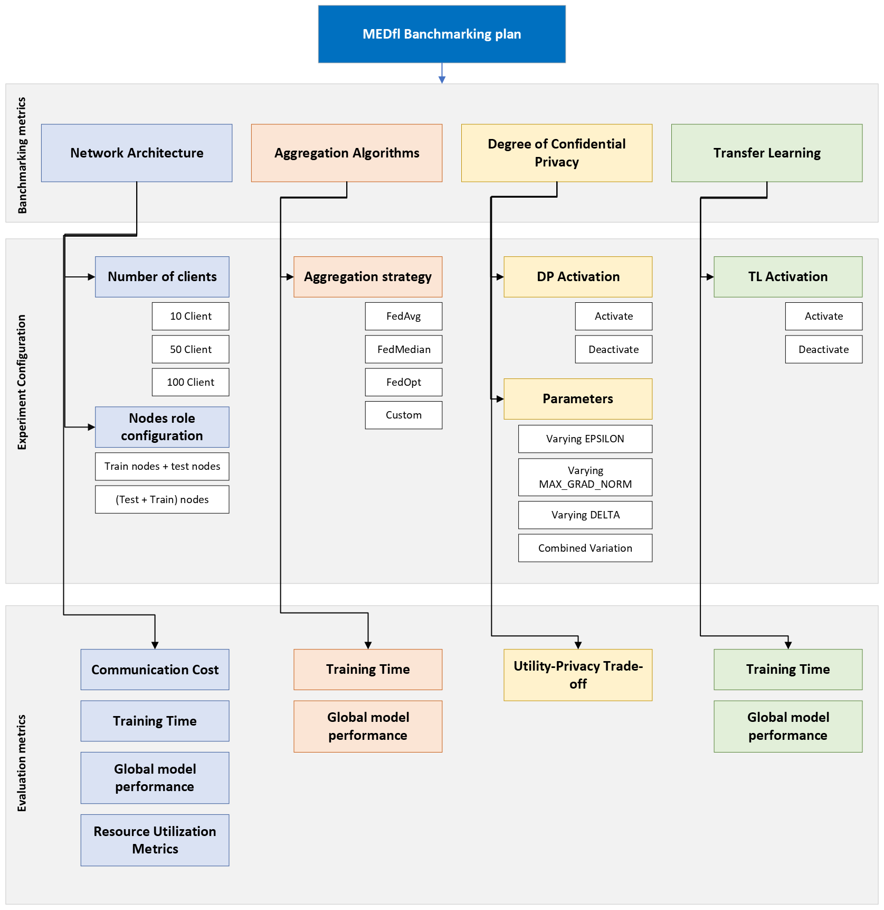

# Banchmarking plan

## Table of content 

1. [Introduction](#1-introduction)
2. [Benchmarking Metrics](#2-benchmarking-metrics)
   - [2.1. Network Architecture](#21-network-architecture)
   - [2.2. Aggregation Algorithms](#22-aggregation-algorithms)
   - [2.3. Degree of Confidential Privacy](#23-degree-of-confidential-privacy)
   - [2.4. Transfer Learning](#24-transfer-learning)
3. [DataSets](#3-datasets)

## 1. Introduction
This benchmarking test is designed to test the performance of the **MEDfl** package across various metrics 
and compare the results. The selected metrics encompass four key dimensions: **model type, network architecture, aggregation algorithms, and the degree of differential privacy.**

## 2. Banchmarking metrics 

### 2.1. Network Architecture:

#### **Objective:**
Evaluate the scalability and performance of **MEDfl** package under different network architectures.

#### Plan:
* Vary the number of clients participating in the federated learning process ``(e.g., 10 clients, 50 clients, 100 clients).``
* Measure the performance metrics as the number of clients increases to test scalability.
* test different configurations ``(e.g., define test nodes and train nodes VS each node is responsible for training and testing )``

### 2.2. Aggregation Algorithms:

#### **Objective:** 
Assess the impact of different aggregation algorithms on the federated learning performance.

#### Plan:
* Test various aggregation algorithms ``(e.g., FedAvg, FedMedian,FedOpt)`` within **MEDfl**.
* Benchmark the package using the same model type but different aggregation algorithms.

### 2.3. Degree of Confidential Privacy:

#### **Objective:** 
Investigate the impact of confidential privacy mechanisms on the federated learning performance.

#### Plan:
* Benchmark the package with and without differential privacy activation   ``(diff_privacy = True, diff_privacy = FALSE )``.
* Evaluate the trade-off between privacy and performance by measuring metrics.
* Activate the differential privacy and bacnhmark the privacy parameters ``( MAX_GRAD_NORM , EPSILON and DELTA)``

### 2.4.  Transfer Learning:

#### Objective: 
Evaluate the performance of the MEDfl package under the activation of transfer learning.

#### Plan:
* Benchmark the package in two scenarios: initializing a model from scratch and utilizing a pretrained model. Compare and analyze the performance differences between the two approaches.

## 3. DataSets
in this banckmarking we will the eiCU dataset, This dataset consists of various tabular data containing diverse information about patients. Each table includes columns identifying hospitals, and the target variable is a binary column indicating the survival or death of the patient.

